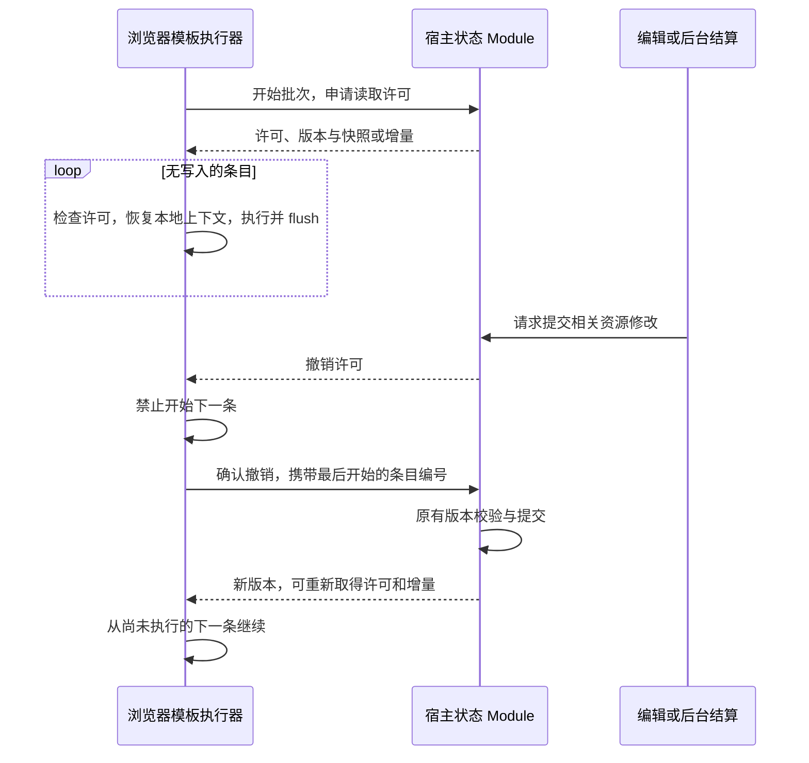

# 模板投影状态同步优化方案

状态：第一阶段验证完成，触发停止条件，未实施读取许可协议。当前部署保留逐条刷新。目标是在不缓存模板结果、不改变 LLM 请求前缀和逐条 EJS 执行语义的前提下，减少 `renderMany` 的状态刷新 RPC。

## 第一阶段结果（2026-09-18）

当前不存在已证明覆盖全部写入的生产路径，因此不添加默认关闭、实际上无法启用的许可协调器。下面保留原设计及其约束，供未来存储契约改变后重新评估。

| 状态来源 | 当前读写路径 | 许可覆盖缺口 |
| --- | --- | --- |
| 聊天、输入、历史与生命周期 | `tavern-script-host-adapter.js` 的 `resolveChat` / slice、`updateChat` / `patchChat`；其他聊天业务共用持久化层 | 聊天 revision 只描述聊天，不能代表全部模板环境；需要覆盖全部业务写入及外部存储写入 |
| 共享全局变量 | `prompt-template-global-variables.js` → `profile-data-store.js` → `durable-file-promotion.js` | 另一存储实例可提交；直接文件写入可绕过宿主；当前 `.write-lock` 协调合作写者，不包含浏览器读者撤销 |
| 模板设置 | `tavern-extension-settings.js` → Profile 存储 | 与共享变量相同，进程内保存入口不是全部写者 |
| 卡、世界书与绑定 | `worldbook-library.js` 的 `bound` / `templateSnapshot` 每次读取资源及绑定 | 不受单一聊天 revision 约束；磁盘变化不经过浏览器许可 ACK |
| 模型 | `index.js` 的 `modelSelection` 读取 DSH Agent `requestHeader().config` 或默认模型选择 | 写入归 DSH 宿主所有，Tavern Profile 写锁不覆盖 |
| 结算中的环境标志 | `tavern-script-host-adapter.js` 的 `settlementTransactions` 和聊天 `settleStatus` | 同时包含内存事务状态，不能仅靠磁盘版本判定 |
| opening 准备 | `opening-preparation.js` 的独立 drafts 与模板状态路由 | 不是常规聊天存储路径，不能因聊天写入被协调就自动启用 |

路径位于 `tavern-plugin/lib/`，其中领域文件在 `domain/`。此表用于判定是否存在阻断项，不是对所有写者覆盖完成的声明。

新增 `tests/template-projection-freshness.test.mjs`，通过生产任务队列、Native Connection、Host Adapter、增量同步和真实临时 Profile 文件验证：

1. 第一条执行期间由另一存储实例提交共享变量，第二条读取新值，不依赖通知。
2. 同样时点直接修改 Profile 文件，第二条读取新值。
3. 聊天 revision 不变，仅宿主模型来源变化，第二条读取新模型。
4. 第一条未保存的 chat、global、model 和任意临时字段修改，在第二条恢复权威上下文。

上述写入安排在第一条读取之后、第二条准入之前，无延时碰运气。测试的模板执行函数是确定性探针；它验证协议的前置条件，不能替代真实浏览器 EJS 或 provider-bound 请求验收。

验证结果：4 项通过。用 Node `registerHooks` 仅在实验进程中把 `session-tasks.js` 的 `await refreshed()` 换成复用第一次结果，4 项均因读取旧值或遗留未保存修改而失败，生产文件未被实验修改。这证明直接跳过刷新会改变现有行为；第四项可由本地恢复解决，前三项仍需协调外部写者。

**决定：停止第二至四阶段。** 保留现有批次传输和精简回执，不声称此次减少了刷新次数或改善了供应商缓存命中率。没有新增生产开关、通知协议或协调器。

后续可选方向：

- 保持逐条最新状态：继续优化每次读取的计算、序列化与传输成本，不能承诺消除每条往返。
- 显式改为整批固定快照：外部修改到下批生效，另行定义模板自身保存、失败及本地恢复规则。这会改变模板可见结果，需要新的产品决定；本次未实施。
- 收拢全部存储与宿主环境写入：需覆盖跨进程、直接文件及 DSH 模型写入，不是新增进程内锁即可完成，目前不值得为这项局部优化扩展成整体架构改造。

## 结论

采用**可撤销的读取许可 + 版本化增量同步 + 逐条刷新回退**。仅在全部相关写入可被协调时进入快速路径。推送通知本身不证明数据最新，不能用“尚未收到变更”或 TTL 当作读取许可。

这比单纯增加浏览器缓存复杂：需要统一模板所依赖资源的写入路径。第一阶段必须先证实写入覆盖率；若实际部署允许其他进程直接修改相关文件、又无法接入协调器，则该部署保持逐条刷新。不能为了兑现性能目标隐瞒一致性降级。

## 现状与约束

- `host-build/session-tasks.js`：每个条目调用 `refreshed()` → 原 `plugin.project('render')` → `flush()`。批次已经合并领取、启动和完成回执。
- `host-build/native-connection.js`：现有游标支持全量/增量传输，并负责保存队列、三方合并回执及恢复被模板临时修改的本地数据。
- `full-prompt-template-sync.js`：游标按聊天 revision/lifecycle 检查兼容性，环境字段另做指纹比较；游标不是未来数据不变的承诺。
- `session-signal-transport.js`：每个 session/kind 保留最新信号，允许合并；不是有完整重放保证的资源变更日志。沿用它唤醒消费者，不把它改成新的权威状态。
- `tavern-script-host-adapter.js`：聊天、全局变量、设置等已有独立的写入与冲突校验。全局变量可能被另一对话修改。现有通知未覆盖全部写入。
- 文件版本检查能发现已发生的修改，但不能阻止“检查之后、模板执行之前”发生未经协调的写入。文件监听也不能提供此保证。

必须保留：每条 prepare 事件、作用域串接、随机顺序、激活集合重置、错误隔离和保存 flush；单条执行中已有的快照读语义；未开始的下一条不能在外部写入已提交后继续使用旧状态。执行失败不自动重跑；不重写 system/tools/history，不凭投影对照宣称已验证供应商缓存命中率。

## 一致性契约

一次条目开始执行，是它使用该快照的读取时点。条目开始之后发生的外部修改不要求改变正在运行的上下文，这与现在先 refresh 再执行一致。

关键不变量：**外部写入提交前，所有相关旧读取许可必须已经确认撤销；撤销确认后，浏览器不得用该许可开始下一条。**

因此“许可仍有效但变更通知在路上”时，宿主尚未提交新状态，浏览器开始读取旧状态仍合法。不能采用先提交、再发失效通知的普通缓存模式来替代这一规则。

未取得撤销确认时，不能仅因网络断开或时间经过，就假定读者停止。协调等待必须有上限：超限使该次写入明确返回可重试的忙状态，不偷偷提交；后续批次降级旧刷新路径。强制终止读者属于显式取消，需要确认对应执行器已停止并围住迟到写入/回执，不能冒充正常读许可过期。需评估这个写入等待代价；若产品不能接受，改用“整批固定快照”将是另一项需要明确批准的语义选择。

## Module 与 Interface

新增 `Template Projection State` Module，作为状态读取与模板存储写入之间的 seam，内部集中版本、依赖追踪、许可撤销、增量和回退。`worldbook-recall.js` 继续只提交模板批次，不知道缓存协议。

概念 Interface：

```text
openProjection(sessionId, runtimeId, batchId, cursor)
  -> { mode: guarded | refresh-each-entry, permit?, versions, snapshotOrDelta }

invalidate(resources, commitMutation)
  -> 撤销相关许可、等待确认、执行原有带版本校验的写入、发布新版本

ackRevocation(permitId, generation, lastStartedEntry)
finishProjection(permitId)
```

这不是要求新增四个独立 RPC：`openProjection` 可与已有 start 回执合并，完成释放可与 complete 合并；撤销确认走现有连接的明确消息/响应。协议对象绑定 host epoch、session、runtime、batch、generation，不能跨页、跨重启或跨会话复用。旧客户端能力不匹配时使用原路径。

浏览器内部提供 `beforeEntry()` / `afterEntry()`；刷新、恢复本地草稿和写后协调收在 Module 内，不散落到模板调用点。普通 render 和旧渲染接口不变。

## 状态版本与首次读取

版本集合至少包括：Chat revision、Timeline branch/lifecycle、待提交输入、人物卡、绑定关系及每本世界书、模板设置、全局变量、用户称呼及当前模型/正则等环境来源。资源依赖按真实存储标识建立，不按页面显示名称建立。

只复用现有权威版本，不新增可独立修改的第二份版本事实。host epoch 和许可 generation 负责防止重启/旧页重用；磁盘资源版本必须来自存储 Module。

首次读取先确定依赖集，在同一协调流程内捕获快照和资源版本并授予许可；绑定关系在读取中变化时重新确定依赖。不得先返回快照、过一会才登记读者。这里只能重读尚未求值的数据，不重放已开始的模板。快照游标丢失则全量返回。

## 正常与写入流程



### 无写入

批次开始取得一次数据，随后每条在本地恢复与原刷新等价的模板上下文，继续调用原 prepare/render/flush。不能简单删掉 refresh：上游可能直接修改 snapshot，临时变量与其他未保存修改必须按既有规则恢复；成功 scopes 则继续串接。基线快照应与可变执行草稿分离。

### 外部编辑或后台结算

先标记依赖为待写并停止授予冲突许可，再撤销现有读者。浏览器收到撤销便禁止新的条目进入；已开始条目允许按旧快照完成，其后续写入仍走原冲突校验。撤销确认不等待该条目 flush 完成，以免“条目等待保存、写者等待条目结束”死锁。

收到确认后才提交外部写入，发布新版本。浏览器在条目交接点刷新/取得新许可后继续，不重新执行前面的条目。共享世界书或全局变量要撤销所有依赖它的读者，不能只通知触发修改的 session。

### 模板自身写入

保存前暂停该批次的新条目准入，主动交还自身许可，再走统一写入协调与现有 expected-version/三方合并。多个读者同时写时都先交还许可，按确定顺序提交，避免锁升级死锁。

保存成功且回执包含足够完整的权威状态和版本时，可在回执中同时返回新许可/增量；否则保守刷新后再授予许可。失败沿用现有错误处理，不自动重跑模板。`executeTemplateHostCommand` 等无法证明修改范围的调用默认使整个投影许可失效，直到重新读取。

每个异步宿主写入必须携带运行时/批次身份并接受生命周期校验；旧页及取消后的迟到结果不得恢复许可。非宿主托管的外部网络副作用不在事务保障范围内，不能据此重试 EJS。

## 通知与故障恢复

- 可复用现有 mux 连接，不为每个聊天新增 SSE/WebSocket。
- 通知是“有待处理的撤销/版本变化”提示；待确认撤销记录留在宿主，直到精确身份的 ACK 到达，不依赖某条瞬时信号不丢失。
- 现有信号可合并，故被合并的撤销仍须能从宿主状态获取；不得使用一次性的 latest-kind 消息作为撤销事实。
- 旧 epoch、重复 ACK、乱序或游标缺失：拒绝旧许可，恢复完整快照；不得用较旧增量覆盖新快照。
- 重连/宿主重启：清除浏览器许可，只在重新授予后开始下一条。正在运行条目的结果、写入和回执按现有生命周期规则处理，不重放。
- 多进程/直接文件写入无法纳入协调：该资源标记为不可授予许可，整批使用逐条刷新。不能仅以“通常只有一个宿主”推定安全。

## 实施顺序与停止条件

1. **列出并测试所有写入来源。** 聊天写入、后台结算、编辑/导入/删除、人物卡和绑定变更、设置及全局变量、脚本命令、升级/外部文件操作。证明所有相关提交经过协调器之前不开快速路径。此阶段只有观测与协议测试。
2. **建立宿主协调与客户端准入。** 先只针对一条可受控的真实路径完成申请、撤销、ACK、写入、继续及故障闭环，不扩成通用缓存框架。Module 未覆盖的路径明确返回 fallback。
3. **接入 renderMany。** 每批首次刷新，无变更时本地恢复；保持原逐条路径可用。版本冲突是执行错误/协调结果，不是缓存未命中后重放理由。
4. **验证后按部署能力启用。** 先灰度受控单宿主环境，监测命中、撤销等待、fallback 原因、刷新次数和整轮时间。若多数资源因不可协调写入导致回退，停止扩大改造，重新评估固定快照契约是否更合适。

需要先确认的产品代价：外部写入可能等待读者撤销确认；确认超时可返回忙状态。如果不接受此代价，则不能同时承诺“零逐条往返”和“逐条读取已提交的最新状态”。

## 验收

正确性先于耗时。使用实际宿主状态 Module、浏览器、上游模板和模型请求捕获 seam，单纯 mock 的结果一致不够。

- 无并发修改：新旧路径完整 provider-bound 请求逐字比较，覆盖 system、tools、消息顺序及内容；供应商缓存使用量另测，不能从字符串比较推导价格。
- 有确定调度的并发修改：在条目准入前/后、撤销前/后、保存前/后注入改动，验证允许的读取时点及下一条所见版本。
- 覆盖跨会话全局变量、共享多世界书、opening、历史导入、用户输入预处理、后台结算、模板自身写入及失败作用域恢复。
- 模拟丢失/重复/乱序通知、双读者同时写、冻结页、断线、重启、旧回执、快照游标淘汰；不接受旧许可、不重放已执行条目、不永久卡住后续正常任务。
- 外部直接写文件及多宿主未受控模式明确走 fallback；回退后保持现有正确性和错误可见性。
- 相同 20 控制器、2 次投影的无写入受控案例：目标状态读取 40 → 2，全部 40 次求值和 prepare 事件仍在。开始回执暂不合并时 RPC 约 46 → 8；合并开始读取后另行核算。存在写入时读取按实际失效增加，不强求固定次数。
- 所有性能数字标注网络延迟、数据规模和是否受控模式。此前 1.41 s → 0.19 s 的 pinned 实验不是本设计的验收承诺。
